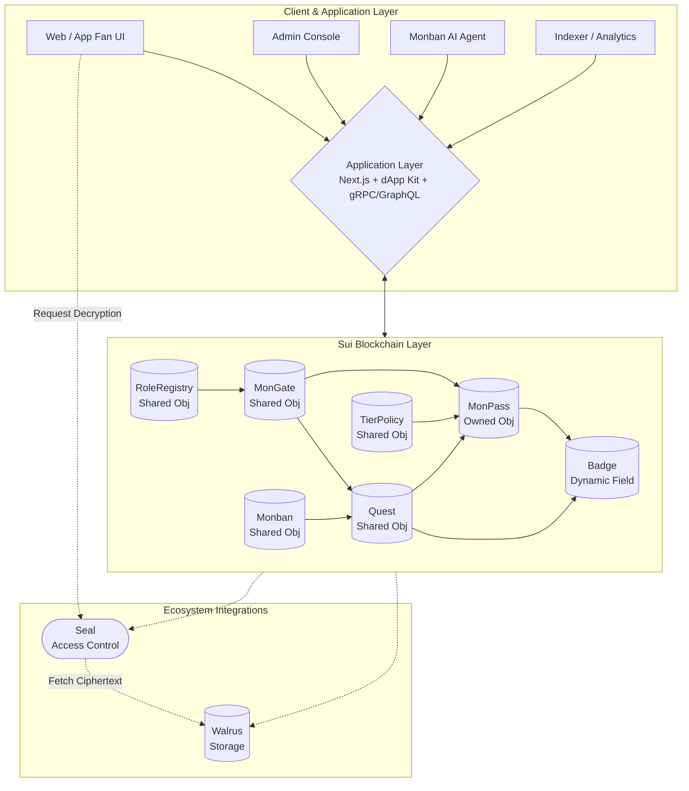

# 門 (MON): ONE Samurai Fan Dojo Platform

## Overview

**MON (門)** is a fan dojo platform built on the Sui blockchain, specifically designed for ONE Championship's Japanese expansion, "ONE Samurai". 

At its core, MON transforms every ONE fighter into a "gate" (門). Fans can formally "enter" these gates as disciples (門徒), adopting a long-term identity rather than just offering short-term attention during major events. This approach establishes a sustainable, uniquely Japanese sense of belonging within the combat sports community.

## Core Concepts

*   **MonGate (The Gate):** Each fighter corresponds to a gate. It sets the rules for entry and tier configurations.
*   **MonPass (The Disciple Pass):** A non-transferable (soulbound) on-chain identity for the fan. It records their journey, experience points (XP), ranks, and earned badges.
*   **Quests & Honor XP:** Fans engage in various quests (e.g., event predictions, on-site QR scans) to earn Honor XP and badges. These rewards are purely reputational and experiential, ensuring compliance with Japanese anti-gambling regulations.
*   **Gated Content:** By integrating with Walrus and Seal, exclusive content (such as behind-the-scenes footage and post-fight interviews) is securely unlocked based on a fan's MonPass rank and tier.
*   **Monban (The Gatekeeper):** An AI persona representing the fighter's gate. It interacts with fans off-chain whilst having its identity and actions anchored on-chain for verifiability.

## System Architecture

The following flowchart outlines the high-level system architecture of the MON platform, mapping the client interfaces to the Sui blockchain and ecosystem integrations.

## Why Sui?

The decision to build on Sui is driven by several architectural advantages:

1.  **Object-Centric Model:** Sui's architecture perfectly maps to the concepts of "Gates", "Passes", "Quests", and "Badges". Each asset has an independent state and ownership.
2.  **Web2-Friendly UX:** Utilising **zkLogin**, fans can easily onboard through familiar OAuth providers (Google, Apple, X) without the friction of traditional crypto wallets.
3.  **High Throughput & Low Latency:** The platform handles high-frequency fan interactions and real-time updates smoothly without transaction bottlenecks.
4.  **Native Ecosystem Integration:** **Walrus** provides decentralised storage for fighters' media, whilst **Seal** enforces robust, on-chain access controls tied directly to the fan's MonPass.

## Legal & Compliance Framework

Navigating the Japanese market necessitates strict adherence to local laws. The platform guarantees:
*   **No Gambling Features:** All quests are free to enter. Rewards are strictly honour-based (XP) or experiential.
*   **Non-Financial Connectivity:** The MonPass is soulbound, ensuring it is not classified as an investment commodity or security. 
*   **Data Privacy:** Personally Identifiable Information (PII) is stored off-chain in encrypted databases, completely compliant with the APPI, whereas the blockchain only stores pseudonymous IDs.

## Future Roadmap

*   **Gym Network Integration:** Extending the platform to include physical dojos and gyms across Japan, allowing fans to check in and earn experience offline.
*   **Samurai Arena Passes:** Tokenising exclusive event experiences (e.g., backstage tours, meet-and-greets).
*   **Compliance Studio:** A modularised framework for ONE's marketing team to safely design new campaigns within pre-approved legal boundaries.
*   **Global Expansion:** Replicating the MON model in other key markets like South Korea and Thailand, tailoring the "gate" concept to local martial arts cultures.

## License

*To be defined.*
