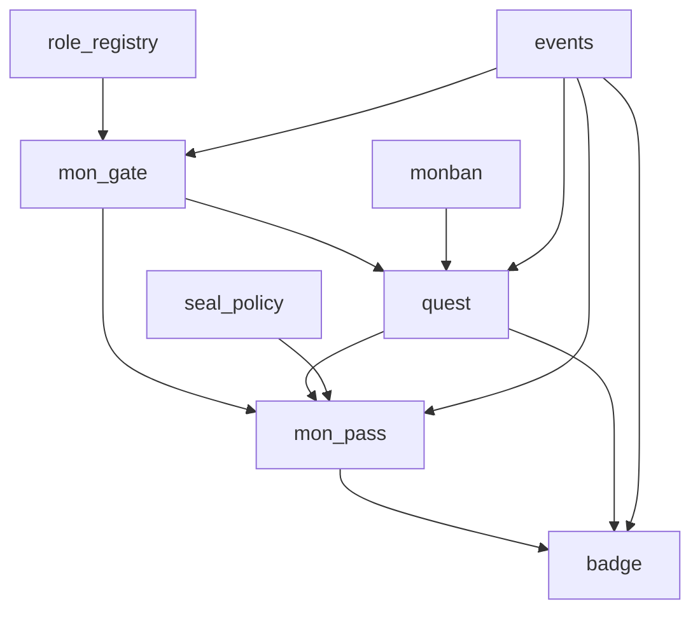

# MON Platform — System Architecture Specification

**Version:** 1.0
**Date:** 2026-04-20
**Status:** Approved by Architecture Review
**Target Launch:** 2026-04-29 (ONE Samurai Ariake Arena)

---

## Executive Summary

MON (門) is a fan dojo platform built on Sui blockchain for ONE Championship's Japanese expansion (ONE Samurai). Each fighter is a "gate" (門), fans formally "enter" as disciples (門徒) with soulbound identity passes, complete quests for honor XP, and unlock gated content — all without gambling, tradeable tokens, or investment mechanics.

**Key Architecture Decisions:**

| Decision | Choice |
|----------|--------|
| Badge storage | Dynamic Fields on MonPass |
| MonGate ownership | Shared Object + Role-based access |
| Quest verification | Hybrid (backend / QR / AI Monban) |
| Badge transfer | Gate-scoped (same gate only) |
| XP/Rank | On-chain auto-rank at threshold |
| Content gating | Tiered Seal Policy |

**SUI Ecosystem Integrations:** zkLogin, Walrus, Seal, Display V2

---

## 1. System Overview

```
┌─────────────────────────────────────────────────────────────┐
│                      MON Platform                           │
│                                                             │
│  ┌──────────┐  ┌──────────┐  ┌──────────┐  ┌────────────┐  │
│  │ Web/App  │  │  Admin   │  │  Monban   │  │  Indexer/  │  │
│  │ (Fan UI) │  │ Console  │  │ AI Agent  │  │  Analytics │  │
│  └────┬─────┘  └────┬─────┘  └─────┬─────┘  └─────┬──────┘  │
│       │              │              │               │        │
│  ─────┴──────────────┴──────────────┴───────────────┴─────  │
│                    Application Layer                         │
│         (Next.js + @mysten/dapp-kit + gRPC/GraphQL)         │
│  ─────────────────────────────────────────────────────────  │
│       │              │              │               │        │
│  ┌────┴──────────────┴──────────────┴───────────────┴────┐  │
│  │                   Sui Blockchain                       │  │
│  │                                                       │  │
│  │  ┌─────────┐ ┌─────────┐ ┌────────┐ ┌─────────────┐  │  │
│  │  │MonGate  │ │MonPass  │ │ Quest  │ │   Monban    │  │  │
│  │  │(shared) │ │(owned)  │ │(shared)│ │  (shared)   │  │  │
│  │  └─────────┘ └─────────┘ └────────┘ └─────────────┘  │  │
│  │  ┌─────────┐ ┌─────────────┐ ┌────────────────────┐  │  │
│  │  │ Badge   │ │ RoleRegistry│ │  TierPolicy        │  │  │
│  │  │(dynamic │ │  (shared)   │ │    (shared)        │  │  │
│  │  │ field)  │ └─────────────┘ └────────────────────┘  │  │
│  │  └─────────┘                                          │  │
│  └───────────────────────────────────────────────────────┘  │
│       │                                      │              │
│  ┌────┴─────┐                          ┌─────┴──────┐       │
│  │  Walrus  │                          │    Seal    │       │
│  │ (storage)│                          │  (access)  │       │
│  └──────────┘                          └────────────┘       │
└─────────────────────────────────────────────────────────────┘
```

### Core Flows

1. **Fan Onboarding:** Fan UI → zkLogin → read MonGate (shared) → mint MonPass (owned by fan)
2. **Quest Completion:** Fan completes task → Validator signs proof → contract verifies → update XP + auto-rank + mint Badge
3. **Content Unlock:** Fan requests content → Seal checks MonPass tier → Walrus returns decrypted content
4. **Monban Interaction:** Fan chats → off-chain AI → triggers on-chain tx (signed by Monban identity)
5. **Admin Operations:** Admin Console → RoleRegistry verifies permission → update MonGate / Quest config

### Data Access Strategy

| Need | Solution |
|------|----------|
| Real-time object state | gRPC (SUI primary API) |
| Complex frontend queries | GraphQL (beta) |
| Leaderboards, analytics, history | Custom Indexer → PostgreSQL |
| Event-driven notifications | Custom Indexer event listener |

---

## 2. Module Architecture

```
mon/
├── Move.toml
└── sources/
    ├── mon_gate.move        # MonGate object + entry logic
    ├── mon_pass.move        # MonPass object + XP/rank
    ├── quest.move           # Quest definition + completion
    ├── badge.move           # Badge type + gate-scoped transfer
    ├── monban.move          # AI agent on-chain identity
    ├── role_registry.move   # Role-based access control
    ├── seal_policy.move     # Tiered Seal policy
    └── events.move          # All event structs
```

### Module Dependency Graph



### Module Responsibilities

| Module | Responsibility | Shared Objects |
|--------|---------------|----------------|
| `role_registry` | Platform-wide RBAC (PlatformAdmin, GateManager, QuestCreator, QuestValidator) | `RoleRegistry` |
| `mon_gate` | Gate CRUD, entry rules, tier config | `MonGate` (per fighter) |
| `mon_pass` | MonPass mint, XP accumulation, auto-rank | — (owned by fan) |
| `quest` | Quest creation, hybrid validation dispatch, reward distribution | `Quest` (per quest) |
| `badge` | BadgeType definition, mint as dynamic field, gate-scoped transfer | — (dynamic field) |
| `monban` | AI agent on-chain identity, signature verification, action log | `Monban` (per gate) |
| `seal_policy` | Tier definition, condition combination, Seal protocol integration | `TierPolicy` (per gate) |
| `events` | Centralized event struct definitions for indexer consumption | — |

---

## 3. Data Structures

### RoleRegistry

```move
public struct RoleRegistry has key {
    id: UID,
}
// Dynamic fields: (role_type: u8, address) => bool
// Role types: 0=PlatformAdmin, 1=GateManager, 2=QuestCreator, 3=QuestValidator
```

### MonGate

```move
public struct MonGate has key {
    id: UID,
    name: String,
    fighter_id: String,
    entry_rule: u8,            // 0: open, 1: invite_code, 2: quest_required
    is_active: bool,
    created_at: u64,
    member_count: u64,
}
// Dynamic fields:
//   "rank_thresholds" => vector<u64>
//   "invite_code" => String
//   "tier_config" => TierConfig

public struct TierConfig has store, drop {
    tiers: vector<Tier>,
}

public struct Tier has store, drop, copy {
    name: String,
    min_rank: u8,
    required_badges: vector<ID>,
}
```

### MonPass (Soulbound)

```move
public struct MonPass has key {  // NO `store` = soulbound
    id: UID,
    gate_id: ID,
    owner: address,
    xp: u64,
    rank: u8,
    joined_at: u64,
    quests_completed: u64,
}
// Dynamic fields: Badge objects, QuestCompletion records
```

### Badge

```move
public struct Badge has store, drop, copy {
    badge_type_id: ID,
    name: String,
    gate_id: ID,
    earned_at: u64,
    transferable: bool,
}

public struct BadgeType has key, store {
    id: UID,
    gate_id: ID,
    name: String,
    description: String,
    image_url: String,
    transferable: bool,
    max_supply: Option<u64>,
    minted_count: u64,
}
```

### Quest

```move
public struct Quest has key {
    id: UID,
    gate_id: ID,
    title: String,
    quest_type: u8,            // 0: quiz, 1: qr_scan, 2: ai_interaction, 3: custom
    xp_reward: u64,
    badge_type_id: Option<ID>,
    validator_type: u8,        // 0: backend, 1: qr_verifier, 2: monban
    start_time: u64,
    end_time: u64,
    is_repeatable: bool,
    max_completions: Option<u64>,
    completion_count: u64,
}

public struct QuestCompletion has store, drop {
    quest_id: ID,
    completed_at: u64,
    validator: address,
}
```

### Monban

```move
public struct Monban has key {
    id: UID,
    gate_id: ID,
    public_key: vector<u8>,
    name: String,
    persona: String,
    action_count: u64,
}
```

### TierPolicy

```move
public struct TierPolicy has key {
    id: UID,
    gate_id: ID,
}
```

---

## 4. Core Functions

### MonGate Operations

```move
public fun create_gate(registry: &RoleRegistry, name: String, fighter_id: String, entry_rule: u8, rank_thresholds: vector<u64>, ctx: &mut TxContext);
public fun join_gate(gate: &mut MonGate, invite_code: Option<String>, ctx: &mut TxContext): MonPass;
public fun update_rank_thresholds(registry: &RoleRegistry, gate: &mut MonGate, new_thresholds: vector<u64>, ctx: &mut TxContext);
public fun set_tier_config(registry: &RoleRegistry, gate: &mut MonGate, tiers: vector<Tier>, ctx: &mut TxContext);
```

### MonPass Operations

```move
public(package) fun add_xp(pass: &mut MonPass, gate: &MonGate, amount: u64);
public fun xp(pass: &MonPass): u64;
public fun rank(pass: &MonPass): u8;
public fun gate_id(pass: &MonPass): ID;
```

### Quest Operations

```move
public fun create_quest(registry: &RoleRegistry, gate: &MonGate, title: String, quest_type: u8, xp_reward: u64, badge_type_id: Option<ID>, validator_type: u8, start_time: u64, end_time: u64, is_repeatable: bool, max_completions: Option<u64>, ctx: &mut TxContext);
public fun complete_quest(quest: &mut Quest, pass: &mut MonPass, gate: &mut MonGate, validator_sig: vector<u8>, validator_addr: address, registry: &RoleRegistry, clock: &Clock, ctx: &mut TxContext);
```

### Badge Operations

```move
public fun create_badge_type(registry: &RoleRegistry, gate: &MonGate, name: String, description: String, image_url: String, transferable: bool, max_supply: Option<u64>, ctx: &mut TxContext): BadgeType;
public(package) fun mint_badge(badge_type: &mut BadgeType, pass: &mut MonPass, clock: &Clock);
public fun transfer_badge(from_pass: &mut MonPass, to_pass: &mut MonPass, badge_type_id: ID, clock: &Clock);
```

### Monban Operations

```move
public fun register_monban(registry: &RoleRegistry, gate: &MonGate, public_key: vector<u8>, name: String, persona: String, ctx: &mut TxContext);
public fun monban_complete_quest(monban: &mut Monban, quest: &mut Quest, pass: &mut MonPass, gate: &mut MonGate, sig: vector<u8>, clock: &Clock, ctx: &mut TxContext);
```

### Access Control Matrix

| Function | PlatformAdmin | GateManager | QuestCreator | QuestValidator | Fan |
|----------|:---:|:---:|:---:|:---:|:---:|
| create_gate | ✓ | ✓ | | | |
| join_gate | | | | | ✓ |
| create_quest | | | ✓ | | |
| complete_quest | | | | ✓ | |
| create_badge_type | | ✓ | | | |
| transfer_badge | | | | | ✓ |
| register_monban | ✓ | | | | |
| grant_role | ✓ | | | | |

---

## 5. Permission System

### Role Architecture

```
RoleRegistry (shared object)
├── Dynamic Field: (0, 0xAdmin1) => true     // PlatformAdmin
├── Dynamic Field: (0, 0xAdmin2) => true     // PlatformAdmin
├── Dynamic Field: (1, 0xManager1) => true   // GateManager
├── Dynamic Field: (2, 0xCreator1) => true   // QuestCreator
├── Dynamic Field: (3, 0xBackendSvc) => true // QuestValidator
└── Dynamic Field: (3, 0xMonbanAddr) => true // QuestValidator (AI)
```

### Bootstrap

```move
fun init(ctx: &mut TxContext) {
    let registry = RoleRegistry { id: object::new(ctx) };
    dynamic_field::add(&mut registry.id, (ROLE_PLATFORM_ADMIN, ctx.sender()), true);
    transfer::share_object(registry);
}
```

### Security Invariants

1. Only PlatformAdmin can grant/revoke roles
2. `init` runs once (Move package init guarantee)
3. Cannot revoke last PlatformAdmin (prevents lockout)
4. Monban's validator permission independent of its identity — revoke stops all AI chain actions

---

## 6. Event System

```move
// Gate Events
public struct GateCreatedEvent has copy, drop { gate_id: ID, name: String, fighter_id: String, created_by: address }
public struct GateUpdatedEvent has copy, drop { gate_id: ID, field: String, updated_by: address }

// MonPass Events
public struct MonPassMintedEvent has copy, drop { pass_id: ID, gate_id: ID, owner: address, timestamp: u64 }
public struct RankUpEvent has copy, drop { pass_id: ID, gate_id: ID, owner: address, old_rank: u8, new_rank: u8, total_xp: u64 }

// Quest Events
public struct QuestCreatedEvent has copy, drop { quest_id: ID, gate_id: ID, title: String, quest_type: u8, xp_reward: u64 }
public struct QuestCompletedEvent has copy, drop { quest_id: ID, pass_id: ID, gate_id: ID, owner: address, xp_earned: u64, badge_earned: Option<ID>, validator: address, timestamp: u64 }

// Badge Events
public struct BadgeMintedEvent has copy, drop { badge_type_id: ID, pass_id: ID, gate_id: ID, owner: address, timestamp: u64 }
public struct BadgeTransferredEvent has copy, drop { badge_type_id: ID, from_pass_id: ID, to_pass_id: ID, gate_id: ID, timestamp: u64 }

// Monban Events
public struct MonbanRegisteredEvent has copy, drop { monban_id: ID, gate_id: ID, public_key: vector<u8> }
public struct MonbanActionEvent has copy, drop { monban_id: ID, gate_id: ID, action_type: String, target_pass_id: ID, timestamp: u64 }

// Role Events
public struct RoleGrantedEvent has copy, drop { role_type: u8, grantee: address, granted_by: address }
public struct RoleRevokedEvent has copy, drop { role_type: u8, revokee: address, revoked_by: address }
```

### Indexer Metrics Derived from Events

- `MonPassMintedEvent` → onboarding rate, multi-gate ratio
- `QuestCompletedEvent` → participation rate, DAU
- `RankUpEvent` → retention indicator
- `MonbanActionEvent` → AI interaction frequency

---

## 7. Error Handling

```move
// role_registry: 0-99
const ENotPlatformAdmin: u64 = 0;
const ERoleAlreadyGranted: u64 = 1;
const ERoleNotFound: u64 = 2;
const ECannotRevokeLastAdmin: u64 = 3;

// mon_gate: 100-199
const EGateNotActive: u64 = 100;
const EInvalidEntryRule: u64 = 101;
const EInviteCodeRequired: u64 = 102;
const EInviteCodeMismatch: u64 = 103;
const EAlreadyJoined: u64 = 104;
const EEmptyRankThresholds: u64 = 105;
const ERankThresholdsNotAscending: u64 = 106;

// mon_pass: 200-299
const EPassGateMismatch: u64 = 200;
const EXpOverflow: u64 = 201;

// quest: 300-399
const EQuestNotActive: u64 = 300;
const EQuestExpired: u64 = 301;
const EQuestNotStarted: u64 = 302;
const EQuestMaxCompletions: u64 = 303;
const EQuestAlreadyCompleted: u64 = 304;
const EInvalidValidatorSig: u64 = 305;
const EValidatorNotAuthorized: u64 = 306;
const EPassQuestGateMismatch: u64 = 307;

// badge: 400-499
const EBadgeNotTransferable: u64 = 400;
const EBadgeGateMismatch: u64 = 401;
const EBadgeMaxSupply: u64 = 402;
const EBadgeNotFound: u64 = 403;
const ETransferSamePass: u64 = 404;

// monban: 500-599
const EMonbanGateMismatch: u64 = 500;
const EInvalidMonbanSig: u64 = 501;

// seal_policy: 600-699
const ETierNotFound: u64 = 600;
const EAccessDenied: u64 = 601;
```

### Validation Order (per function)

1. Role / permission check → abort early if unauthorized
2. Object relationship check → gate_id match, ownership
3. State check → is_active, time window, supply
4. Business logic check → invite code, signature verify
5. Execute mutation
6. Emit event

---

## 8. Security Considerations

### Threat Model

| # | Attack Vector | Risk | Mitigation |
|---|---------------|------|------------|
| 1 | Fake validator signature | Unlimited XP/Badge | `ed25519_verify` + validator in RoleRegistry |
| 2 | Cross-gate manipulation | Bypass gate scope | Assert `pass.gate_id == quest.gate_id` |
| 3 | Replay attack | Duplicate XP | QuestCompletion as dynamic field (dedup by quest_id) |
| 4 | Role escalation | Admin takeover | Assert caller is PlatformAdmin in grant_role |
| 5 | MonPass transfer via PTB | Break soulbound | No `store` ability → type system prevents transfer |
| 6 | Monban key compromise | Arbitrary rewards | revoke_role + audit trail + rate limit per epoch |
| 7 | XP overflow | State corruption | Checked arithmetic, abort on overflow |
| 8 | Badge supply bypass | Over-minting | minted_count on shared object, consensus guarantees |
| 9 | Seal policy bypass | Content leak | Content encrypted at rest, decryption only via Seal |
| 10 | Admin lockout | Permanent loss of control | Assert admin_count > 1 before last revoke |

### Soulbound Guarantee

```move
public struct MonPass has key { ... }  // Only `key`, no `store`
// ✗ transfer::public_transfer → requires `store`
// ✗ transfer::public_share → requires `store`
// ✗ wrap in another object → requires `store`
// ✓ transfer::transfer (module-only) → used ONCE at mint
```

### Rate Limiting

| Target | Limit | Mechanism |
|--------|-------|-----------|
| Monban actions | Max N per epoch | action_count on Monban object |
| Quest completions | max_completions | completion_count on Quest |
| Badge minting | max_supply | minted_count on BadgeType |
| Gate join | 1 per address per gate | Dynamic field existence check |

---

## 9. Tool Integration

### Integration Map

| Tool | Purpose | Priority |
|------|---------|----------|
| zkLogin | Fan auth with Google/Apple/X | MVP Day 1 |
| Walrus | Fighter media storage | MVP Day 1 |
| Seal | Content access control by tier | MVP Day 1 |
| Display V2 | MonPass/Badge rendering in explorers | MVP Day 1 |
| SuiNS | Human-readable gate names | Phase 2 |
| Kiosk | Badge marketplace (if opened) | Phase 3 |

### zkLogin Flow

```
Fan → OAuth Provider → JWT → Ephemeral Keypair → ZK Proof → Sui Tx (mint MonPass)
```

- SDK: `@mysten/zklogin`
- Self-hosted salt service
- `poseidon_bn254` available on all networks

### Walrus + Seal Content Pipeline

**Upload (Admin):** Video → Seal encrypts (tier policy) → Walrus stores ciphertext → metadata in DB

**Access (Fan):** Request → Seal checks MonPass tier on-chain → returns decryption key → fetch from Walrus → decrypt client-side

### Gas Sponsorship

| Operation | Payer | Notes |
|-----------|-------|-------|
| join_gate | Platform | Sponsored tx, fan pays nothing |
| complete_quest | Platform | Sponsored tx |
| transfer_badge | Fan | Low-frequency, acceptable |
| Admin ops | Admin | Own gas |

---

## 10. Data Layer

### Frontend Data Sources

| Page | Source | Pattern |
|------|--------|---------|
| MonPass detail | gRPC `getObject` | Real-time |
| Gate home | GraphQL | Multi-object filter |
| Leaderboard | Indexer REST API | Pre-aggregated, 30s cache |
| Quest history | Indexer REST API | Paginated |
| Admin dashboard | Indexer REST API | Daily aggregation |

### Off-chain Data

| Data | Storage | Reason |
|------|---------|--------|
| User PII | Encrypted PostgreSQL | APPI compliance |
| Content metadata | PostgreSQL + CDN | High read frequency |
| AI chat history | PostgreSQL | Volume, no chain need |
| OAuth/salt mappings | Redis + encrypted store | zkLogin infra |

---

## 11. Testing Strategy

### Testing Pyramid

- **Unit tests (Move #[test]):** Per-function, all modules
- **Integration tests (Move):** Multi-module scenarios
- **Monkey tests:** Edge cases, overflow, race conditions
- **E2E tests (Testnet):** Full fan journey with zkLogin + Seal

### Key Monkey Test Scenarios

| Scenario | Expected |
|----------|----------|
| Join same gate twice | abort EAlreadyJoined |
| XP near u64::MAX | abort EXpOverflow |
| Concurrent quest completion at max | Second aborts |
| Expired validator timestamp | abort |
| Revoke all admins | Last one aborts |
| Transfer soulbound badge | abort EBadgeNotTransferable |

### Gas Benchmarks

| Operation | Target | Alert |
|-----------|--------|-------|
| join_gate | ~500 MIST | > 1000 |
| complete_quest | ~800 MIST | > 1500 |
| transfer_badge | ~300 MIST | > 600 |

---

## 12. Deployment Plan

### Timeline (Target: ONE Samurai 4/29)

| Phase | Network | Period | Goal |
|-------|---------|--------|------|
| Alpha | Devnet | Week 1-2 | Core contracts + unit tests |
| Beta | Testnet | Week 3-4 | Integration + frontend + gas sponsor |
| RC | Testnet | Week 5 | E2E + load test + security audit |
| Launch | Mainnet | Week 6 (4/29) | Live with first event |

### UpgradeCap Management

| Env | Holder | Policy |
|-----|--------|--------|
| Devnet | Developer | compatible |
| Testnet | Team multisig (2/3) | compatible |
| Mainnet | Ops multisig (2/3) | compatible → additive |

### Monitoring

| Metric | Alert |
|--------|-------|
| Indexer lag | > 100 checkpoints |
| Gas sponsor balance | < 10 SUI |
| Failed tx rate | > 5% in 5 min |
| MonPass mint spike | > 10x baseline |

---

## 13. Gas Optimization

| Strategy | Saving |
|----------|--------|
| MonPass as owned object (no consensus) | ~40% vs shared |
| Dynamic field lazy load | Avoids linear growth |
| Batch XP + Badge in single tx | Save tx overhead |
| Minimal event data (IDs only) | ~30% event gas |
| PTB for compound operations | Amortize base cost |

### Launch Week Budget

~30M MIST ≈ 0.03 SUI for 10K fans + 30K quest completions. Sponsor wallet with 10-50 SUI supports months of operation.

---

## Appendix

### SUI Version Targets

- Protocol: 119 (v1.69.1)
- SDK: `@mysten/sui` (not sui.js)
- Transaction class: `Transaction` (not TransactionBlock)
- Display: V2 (Display Registry `0xd`)
- Data API: gRPC (primary), GraphQL (beta), JSON-RPC (deprecated)

### Compliance Notes

- No gambling: quests are free, rewards are honor/experience only
- MonPass is non-transferable identity, not investment product
- Prize value within 景品表示法 limits
- PII off-chain, APPI compliant
- Chain stores only pseudonymous IDs and behavioral records
